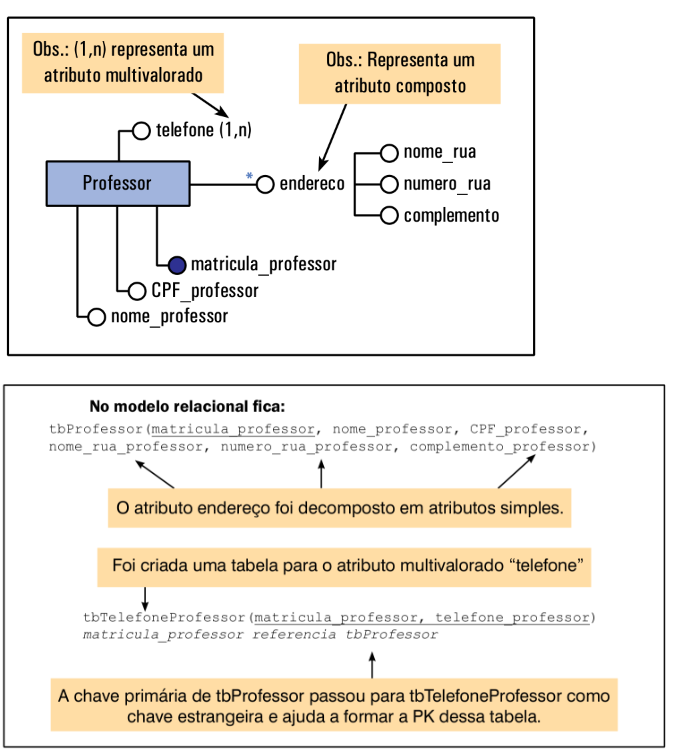
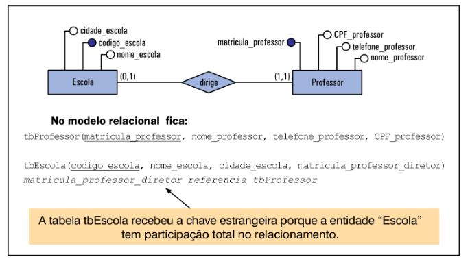
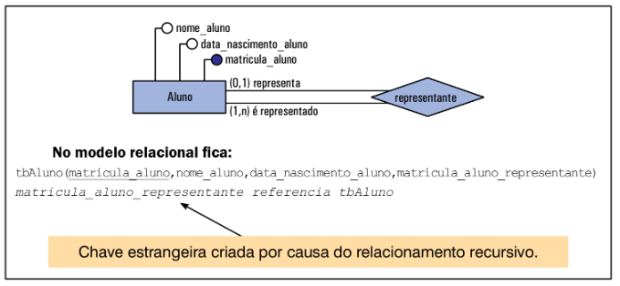
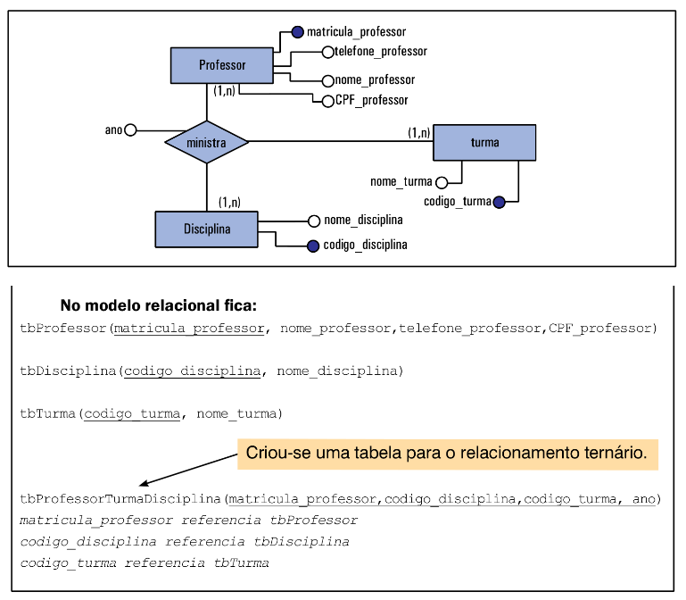
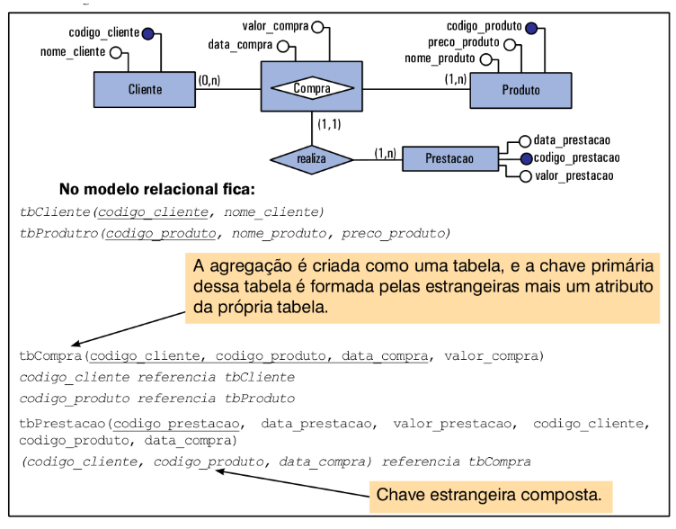

# Conversão entre o Modelo ER e o Modelo Relacional

O modelo relacional é definido usando como base o modelo ER. Lembre-se de que o modelo relacional consiste em uma coleção de **tabelas** e na definição de **chaves estrangeiras** para relacionar essas tabelas. Sendo assim, construir o modelo relacional consiste em definir as **tabelas** e as **chaves estrangeiras**.

Existem algumas regrinhas que devem ser aplicadas para fazer a conversão de um modelo no outro. Vamos entender cada uma dessas regras.

## Entidade

Toda **entidade** do modelo ER vira uma **tabela** no modelo relacional. Essa tabela terá a mesma chave primária (identificador) e os mesmos atributos definidos na entidade.

Caso a entidade tenha **atributos compostos**, eles devem ser decompostos (se ainda não foram).
Por outro lado, uma outra possibilidade seria separar os **atributos compostos** em novas tabelas. No exemplo, o **atributo composto** **endereço** poderia seria uma nova tabela com seus sub-atributos convertidos em colunas desta nova tabela. Além disso, haveria ainda a necessidade de uma chave estrangeira **FK** que referenciasse a chave primária de **Professor**. Esta **FK** seria, simultaneamente, chave estrangeira e chave primária da tabela de **endereço**. Entretanto, deve-se atentar para continuar respeitando a cardinalidade definida anteriormente.

Caso a entidade tenha atributos multivalorados, para cada atributo multivalorado cria-se uma nova tabela. A tabela correspondente ao atributo multivalorado vai ter como atributos o atributo multivalorado em sim + a chave primária da tabela onde o atributo multivalorado estava inserido (que vai passar como chave estrangeira para a nova tabela). As figuras abaixo apresentam um exemplo desta situação.



## Entidade Fraca

Para cada entidade fraca do ER, é criada uma tabela no modelo relacional, incluindo todos os atributos da entidade fraca, mais a chave primária da entidade com a  qual a entidade fraca se relaciona (que passa como uma chave estrangeira). A chave primária desta nova tabela será composta por um ou mais atributos da entidade fraca (geralmente o identificador parcial) + a chave estrangeira (coluna oriunda da chave primária resultante da conversão da entidade forte convertida em tabela relacionada com esta entidade fraca).

## Relacionamento N para N

**Todo relacionamento com cardinalidade - Muitos para Muitos - entre duas entidades, vira uma nova tabela**. Essa nova tabela irá conter todos os atributos do relacionamento (se houver) mais as chaves primárias das entidades que fazem parte desse relacionamento. As chaves primárias que vão passar para a nova tabela como chaves estrangeiras. A **chave primária** da nova tabela será composta pelas **chaves estrangeiras** e, se houver necessidade, por algum **atributo descritivo** (atributo pertencente ao relacionamento do ER).


## Relacionamento 1 para N

Relacionamentos com cardinalidade 1:N não geram nova tabela. No entanto, para que se possa manter o relacionamento cria-se uma chave estrangeira na entidade que possui a cardinalidade N. Se o relacionamento tiver atributos descritivos, esses atributos irão "seguir" a chave estrangeira, ou seja, ficarão na mesma tabela que a chave estrangeira ficar (a da cardinalidade N).


## Relacionamento 1 para 1

Relacionamentos com cardinalidade 1:1 entre duas entidades não geram uma nova tabela. No entanto, deve-se escolher a chave primária de uma das entidades ligadas ao relacionamento e inseri-la como chave estrangeira na outra tabela.

A questão aqui é a seguinte: Qual tabela deve receber a chave estrangeira já que a cardinalidade máxima das duas entidades é 1? Para que possamos decidir quem recebe a chave estrangeira, é necessário considerar o tipo de participação das entidades do relacionamento. O tipo de participação pode ser **total** ou **parcial**.


A **participação total** ocorre quando todos os objetos de uma entidade participam do relacionamento e a **participação parcial** ocorre quando apenas alguns objetos da entidade participam do relacionamento.

Por exemplo (figura abaixo), suponha que tenhamos as **entidades** *Escola* e *Professor*, nas quais se percebe que uma escola sempre tem um professor que é diretor, mas nem todo professor é um diretor. Neste tipo de relacionamento, a entidade *Escola* tem **participação total**, uma vez que **toda** escola terá um diretor. A entidade *Professor* tem **participação parcial**, uma vez que nem todo professor é diretor. Sendo assim, a entidade que participação total *Escola* é que deve receber a chave estrangeira.





Note que a escolha pela entidade que tem participação total é feita para evitarmos valores nulos na tabela. Uma vez que toda escola tem um diretor, não teremos valor nulo para a chave estrangeira.

No caso das duas entidades terem **participalçao total**, fica a critério do desenvolvedor escolher quem receberá a chave estrangeira.

Se as duas entidades tiverem **participação parcial**, também é o desenvolvedor quem decide para onde vai a chave estrangeira, devendo ele fazer uma análise de qual tabela que receberia menos valores nulos e adicionando a chave estrangeira nessa tabela.

Se o relacionamento tiver atributos descritivos, os atributos "seguem" a chave estrangeira, ou seja, os atributos descritivos ficarão na mesma tabela que a chave estrangeira.

## Relacionamento Recursivo

Todo relacionamento recursivo gera uma chave estrangeira que faz referência à chave primária da própria tabela, conforme figura abaixo.




Observe que na descrição do modelo relacional foi adicionado o atributo **matricula_aluno_representante** para especificar o relacionamento recursivo. Este atributo é uma chave estrangeira que faz referência ao atributo **matricula_aluno** da prória tabela **tbAluno**.

## Relacionamentos Ternários ou Maiores


Para cada relacionamento entre mais de duas entidades, cria-se uma tabela contendo todos atributos descritivos do relacionamento (se houver) + as chaves primárias de todas entidades ligadas ao relacionamento (que passam como chaves estrangeiras).

A chave primária da nova tabela, será composta pelos atributos chaves das entidades participantes do relacionamento que tiverem cardinalidade N e, se houver necessidade, mais algum atributo descritivo. As figuras abaixo ilustram um exemplo de conversão de um relacionamento ternário (vindo do diagrama ER) para o modelo relacional.




## Agregação

Uma agregação no modelo ER vira uma tabela no modelo relacional e irá conter seus próprios atributos, mas as chaves estrangeiras de acordo com os seus relacionamentos, como mostra a figura abaixo.





Observe que a tabela **tbPrestacao** possui uma chave estrangeira composta. Essa chave estrangeira é composta porque a sua primária correspondente também é composta.


Quanto temos uma chave primária composta, não podemos passar para outra tabela apenas parte da chave, e por esse motivo sua estrangeira correspondente também será composta.

## Especialização e Generalização

Mapear especializações e generalizações de diagramas ER para o modelo relacional envolve algumas etapas específicas. Aqui está um guia básico para ajudá-lo:

<!--
### Generalização
1. **Criar uma Tabela para a Superclasse**: Crie uma tabela para a entidade genérica (superclasse) com todos os atributos comuns.
2. **Criar Tabelas para as Subclasses**: Crie tabelas separadas para cada subclasse, incluindo os atributos específicos de cada uma.
3. **Chave Estrangeira**: Inclua na tabela da subclasse uma chave estrangeira que referencia a chave primária da superclasse.

### Especialização
Existem duas abordagens principais para mapear especializações:-->

#### 1. **Abordagem de Tabela Única**
- **Tabela Única**: Crie uma única tabela que inclua como colunas todos os atributos da entidade pai e das entidades filhas.
- **Coluna Discriminador**: Adicione uma coluna discriminador para indicar de qual entidade filha cada registro pertence.

#### 2. **Abordagem de Tabelas Separadas**
- **Tabela para Superclasse**: Crie uma tabela para a entidade pai e crie uma coluna para cada atributo comum.
- **Tabelas para Subclasses**: Crie tabelas separadas para cada entidade filha, incluindo como coluna os atributos específicos e uma coluna adicional (chave estrangeira) que referencia a chave primária da tabela que representa entidade pai.

#### 3. **Abordagem de Tabelas Totalmente Separadas**

Crie tabelas separadas para cada entidade filha, incluindo como coluna os atributos específicos e os atributos oriundos da entidade pai. Neste caso, a generalização/especialização definida da etapa de modelagem conceitual (ER) será, formalmente, desfeita e pela perspectiva do modelo relacional as entidades filhas serão consideradas tabelas totalmente independentes e distintas.

### Exemplo Prático (Reflexo na etapa de Implementação Física)

Suponha que temos uma entidade pai "Veículo" com duas entidades filhas (especializações) "Carro" e "Moto":

#### Abordagem de Tabela Única
```sql
CREATE TABLE Veiculo (
    id SERIAL PRIMARY KEY,
    tipo VARCHAR(10),
    placa VARCHAR(10),
    ano INT,
    numero_portas INT, -- específico para Carro
    cilindradas INT, -- específico para Moto
    -- opcional (Veículo, Carro ou Moto)
    discriminador text 
);
```

#### Abordagem de Tabelas Separadas
```sql
CREATE TABLE Veiculo (
    id SERIAL PRIMARY KEY,
    placa VARCHAR(10),
    ano INT
);

CREATE TABLE Carro (
    id SERIAL PRIMARY KEY,
    numero_portas INT,
    veiculo_id integer REFERENCES Veiculo (id)
);

CREATE TABLE Moto (
    id SERIAL PRIMARY KEY,
    cilindradas INT,
    veiculo_id integer REFERENCES Veiculo(id)
);
```

####  **Abordagem de Tabelas Totalmente Separadas**

```sql
CREATE TABLE Carro (
    id SERIAL PRIMARY KEY,
    numero_portas INT,
    placa VARCHAR(10),
    ano INT
);

CREATE TABLE Moto (
    id SERIAL PRIMARY KEY,
    cilindradas INT,
    placa VARCHAR(10),
    ano INT
);
```

### EXTRA: No PostgreSQL

No PostgreSQL, a generalização e especialização de tabelas são implementadas através do conceito de **herança de tabelas**. Aqui está um resumo de como isso funciona:

### Herança de Tabelas no PostgreSQL

A herança de tabelas permite que uma tabela (subclasse) herde a estrutura de outra tabela (superclasse). Isso é útil para modelar hierarquias de entidades, onde a superclasse contém atributos comuns e as subclasses contêm atributos específicos.

#### Criando Tabelas com Herança
Para criar uma tabela que herda de outra, você usa a cláusula `INHERITS`. Aqui está um exemplo prático:

1. **Criar a Superclasse**:
```sql
CREATE TABLE Veiculo (
    id SERIAL PRIMARY KEY,
    placa VARCHAR(10),
    ano INT
);
```

2. **Criar as Subclasses**:
```sql
CREATE TABLE Carro (
    numero_portas INT
) INHERITS (Veiculo);

CREATE TABLE Moto (
    cilindradas INT
) INHERITS (Veiculo);
```

### Consultas em Tabelas Herdadas
Quando você consulta a tabela superclasse, por padrão, o PostgreSQL inclui dados das subclasses. Para consultar apenas a superclasse, você pode usar a cláusula `ONLY`:

```sql
SELECT * FROM ONLY Veiculo;
```

### Vantagens e Limitações
- **Vantagens**: A herança de tabelas facilita a reutilização de estruturas de dados e a manutenção de integridade referencial.
- **Limitações**: Algumas funcionalidades, como chaves estrangeiras e índices, podem não se comportar da mesma forma que em tabelas não herdadas.

### Exemplo Completo
Aqui está um exemplo completo que inclui inserção e consulta de dados:

```sql
-- Inserir dados na superclasse
INSERT INTO Veiculo (placa, ano) VALUES ('ABC1234', 2020);

-- Inserir dados nas subclasses
INSERT INTO Carro (placa, ano, numero_portas) VALUES ('DEF5678', 2021, 4);
INSERT INTO Moto (placa, ano, cilindradas) VALUES ('GHI9012', 2022, 150);

-- Consultar dados da superclasse (inclui dados das subclasses)
SELECT * FROM Veiculo;

-- Consultar dados apenas da superclasse
SELECT * FROM ONLY Veiculo;
```

Essa abordagem permite modelar de forma eficiente hierarquias de entidades no PostgreSQL, mantendo a flexibilidade e a integridade dos dados.

**Links:**

(1) Herança no PostgreSQL - DevMedia. https://www.devmedia.com.br/heranca-no-postgresql/10847.

(2) Banco de dados: Generalização e especialização na Modelagem Conceitual. https://blog.grancursosonline.com.br/banco-de-dados-generalizacao-e-especializacao-na-modelagem-conceitual/.

(3) Banco de Dados II: Generalização e Especialização (aula 3). https://pt.slideshare.net/slideshow/banco-de-dados-ii-generalizao-e-especializao-aula-3/57053731.

(4) BANCO DE DADOS - docente.ifrn.edu.br. https://docente.ifrn.edu.br/elieziosoares/disciplinas/programacao-com-acesso-a-banco-de-dados/4-especializacao-entidade_associativa.
