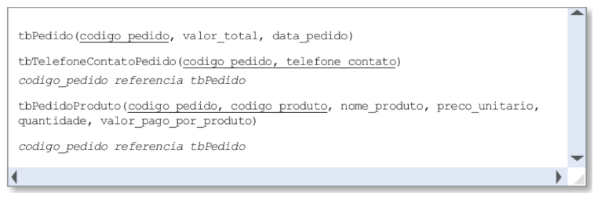
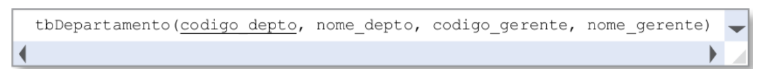

# Normalizacão - Resumo

* **1FN** - Os dados armazenados devem ser **atômicos**. Se a tabela tiver colunas com valores compostos ou multivalorados, esta tabela não está na 1ª forma normal.

* **2FN** - Há alguma **Dependência Funcional Parcial**?  Se sim, não está na 2FN. No modelo relacional, a dependência funcional entre dois atributos, A e B, ocorre quando, em todas as linhas da tabela, para cada valor de A irá aparecer sempre o mesmo valor de B. Ela pode ser **total** ou **parcial**. **Total** quando o atributo/coluna depende de toda a chave primária composta. **Parcial** quando depende de parte da chave primária composta.
   
  * Ex: 

  * **O atributo nome_produto tem uma dependência funcional parcial, porque depende apenas de parte da chave primária, ou seja, depende apenas do codigo_produto.** Logo, temos um problema no modelo relacional já que a 2FN não está sendo respeitada.

* **3FN** - Há alguma **Dependência Funcional Transitiva**? Na tabela há uma coluna não-chave que identica outra coluna não-chave?

  * Ex: 

  * Ocorre dependência funcional transitiva com o atributo **nome_gerente** que depende do atributo **codigo_gerente** que não é chave e nem faz parte da chave primária.
